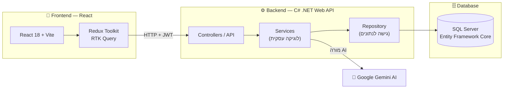
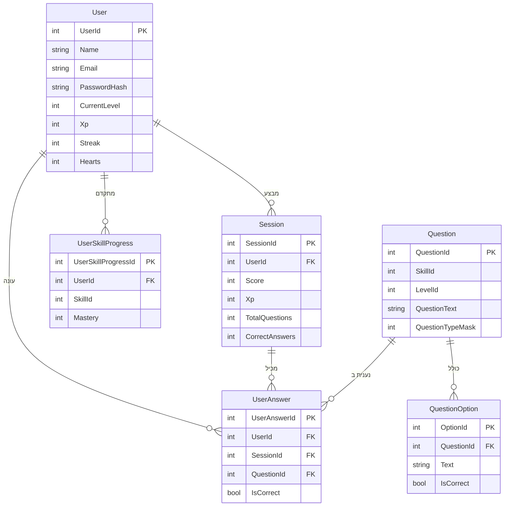

<div align="center">


# 🦉 Glottie — פלטפורמת לימוד אנגלית מבוססת AI

### הדרך הכיפית, החכמה והאפקטיבית ללמוד אנגלית

**פרויקט גמר Full-Stack · React + C# .NET + SQL Server**

[](https://react.dev)
[](https://dotnet.microsoft.com)
[](https://www.microsoft.com/sql-server)
[](https://ai.google.dev)

</div>

---

## 📌 על הפרויקט הזה (למורה)

> **זהו עמוד ההגשה המרכזי של פרויקט הגמר שלי.**
> הפרויקט מורכב משני חלקים (Repositories) — צד לקוח (Frontend) וצד שרת (Backend) — והעמוד הזה מרכז את **שני הקישורים** יחד עם הסבר מלא ומסודר על כל מה שנבנה.

**Glottie** היא אפליקציית **Full-Stack** ללימוד אנגלית בהשראת Duolingo: מערכת גיימיפיקציה (נקודות XP, לבבות, רצפים), מבחן רמה מתאים, שאלות מסוגים רבים, מעקב התקדמות אישי, ומורה AI חכם לשיחה חופשית.

הפרויקט בנוי משלושה רכיבים עיקריים:
- 🎨 **Frontend** — React 18 + Vite + Redux Toolkit
- ⚙️ **Backend** — C# .NET Web API בארכיטקטורה שכבתית (Clean Architecture)
- 🗄️ **Database** — SQL Server עם Entity Framework Core (Code-First + Migrations)

---

## 🔗 שני הקישורים של הפרויקט

<div align="center">

| החלק | תיאור | קישור ל-Repository |
|:---:|:---|:---:|
| ⚙️ **Backend (C# + SQL)** | שרת ה-API, לוגיקת השרת ובסיס הנתונים | **[github.com/tehila4510/MyProject](https://github.com/tehila4510/MyProject)** |
| 🎨 **Frontend (React)** | ממשק המשתמש והאפליקציה | **[github.com/tehila4510/React-Project](https://github.com/tehila4510/React-Project)** |

</div>

> 💡 שני הפרויקטים עובדים יחד: ה-Frontend (React) שולח בקשות ל-Backend (‎.NET‎), שמדבר עם בסיס הנתונים (SQL Server) ועם שירות ה-AI של Google Gemini.

---

## 📖 תוכן עניינים

- [ארכיטקטורה כללית](#-ארכיטקטורה-כללית)
- [סטאק טכנולוגי](#-סטאק-טכנולוגי-tech-stack)
- [יכולות ותכונות](#-יכולות-ותכונות-features)
- [מבנה בסיס הנתונים](#-מבנה-בסיס-הנתונים-database)
- [מבנה קוד השרת (Backend)](#-מבנה-קוד-השרת-backend)
- [נקודות הקצה של ה-API](#-נקודות-הקצה-של-ה-api)
- [מורה ה-AI](#-מורה-ה-ai-glottie-chat)
- [הרצת הפרויקט](#-הרצת-הפרויקט-מהתחלה)
- [גלריית מסכים ומיתוג](#-גלריית-מסכים-ומיתוג)

---

## 🏗 ארכיטקטורה כללית

התרשים הבא מציג כיצד שלושת הרכיבים מתחברים יחד:



**זרימת עבודה טיפוסית:** המשתמש/ת מבצע/ת פעולה באפליקציית React → RTK Query שולח בקשת HTTP עם טוקן JWT ל-API של ‎.NET → ה-Controller מעביר ל-Service (לוגיקה עסקית) → ה-Repository ניגש לבסיס הנתונים דרך Entity Framework → התשובה חוזרת עד למשתמש/ת.

---

## 🛠 סטאק טכנולוגי (Tech Stack)

### 🎨 Frontend
| טכנולוגיה | תפקיד |
|---|---|
| **React 18** | ספריית ה-UI |
| **Vite** | כלי Build ושרת פיתוח מהיר |
| **Redux Toolkit + RTK Query** | ניהול state וקריאות API עם Caching |
| **React Router v6** | ניתוב בין מסכים |
| **Material UI (MUI)** | רכיבי עיצוב |
| **React Toastify** | הודעות למשתמש |
| **Web Speech API** | הקראת שאלות בקול (Text-to-Speech) |

### ⚙️ Backend
| טכנולוגיה | תפקיד |
|---|---|
| **C# / .NET Web API** | שרת ה-REST API |
| **Entity Framework Core** | ORM לגישה לבסיס הנתונים (Code-First) |
| **SQL Server** | בסיס הנתונים |
| **JWT Bearer Authentication** | אימות והזדהות מאובטחת |
| **AutoMapper** | המרה בין Entities ל-DTOs |
| **Google Gemini API** | מנוע ה-AI של מורה השיחה |
| **BackgroundService (Worker)** | איפוס אוטומטי של לבבות כל 24 שעות |
| **Swagger / OpenAPI** | תיעוד ובדיקה של ה-API |

---

## ✨ יכולות ותכונות (Features)

### 🎓 חוויית הלמידה
- **מבחן רמה (Placement Test)** — מבחן קצר שקובע את רמת הפתיחה של המשתמש/ת (A1–C2).
- **בחירת רמה ידנית** — אפשרות לבחור רמה עם תיאור ויזואלי לכל רמה.
- **9 תחומי מיומנות** — אוצר מילים, דקדוק, פעלים, האזנה, קריאה, כתיבה, הגייה, ביטויים, וצ'אט.
- **מנוע שאלות מגוון** — עד 18 סוגי שאלות שונים (בחירה מרובה, השלמת מילים, גרירה, התאמה, סידור, האזנה, הגייה, תרגום ועוד) הממומשים באמצעות **Bitmask** חכם.
- **משוב בזמן אמת** — תשובה נכונה/שגויה עם הסבר מיידי.

### 🎮 גיימיפיקציה
| | תכונה | תיאור |
|:---:|---|---|
|  | **נקודות XP** | צבירת נקודות על כל תרגול והתקדמות בין רמות |
| ❤️ | **לבבות (Hearts)** | מספר טעויות מוגבל לכל סשן, מתאפס אוטומטית כל 24 שעות |
|  | **רצף ימים (Streak)** | מעקב אחרי רצף ימי למידה |
| 🎉 | **קונפטי וחגיגה** | אנימציית סיום מתגמלת בסוף כל תרגול |

### 📊 מעקב והתקדמות
- **דשבורד התקדמות** — גרף XP שבועי, טבעות דיוק, ופירוט לפי מיומנות.
- **"הטעויות שלי"** — עמוד שמרכז כל תשובה שגויה יחד עם התשובה הנכונה, ללמידה מהשגיאות.
- **מפת חום (Heatmap)** — מעקב ויזואלי אחרי ימי התרגול.

### 👤 ניהול משתמש
- הרשמה והתחברות מאובטחים עם **JWT**.
- העלאת תמונת פרופיל (Avatar) עם תצוגה מקדימה.
- עריכת שם, אימייל וסיסמה.
- שמירת Session ב-`localStorage` (המשתמש נשאר מחובר גם אחרי רענון).

---

## 🗄 מבנה בסיס הנתונים (Database)

בסיס הנתונים מנוהל ב-**SQL Server** באמצעות **Entity Framework Core** בגישת **Code-First** (הטבלאות נוצרות מהמחלקות ב-C# דרך Migrations).



**הטבלאות המרכזיות:**
- **User** — פרטי המשתמש, רמה, XP, לבבות ורצף.
- **Session** — סשן תרגול בודד עם ניקוד ומספר תשובות נכונות.
- **Question** + **QuestionOption** — מאגר השאלות והתשובות האפשריות.
- **UserAnswer** — תיעוד כל תשובה שהמשתמש/ת נתן/ה (בשביל "הטעויות שלי").
- **UserSkillProgress** — רמת השליטה (Mastery) של המשתמש/ת בכל מיומנות.

> **רמות ומיומנויות** מנוהלות כ-Static Data בקוד (6 רמות CEFR מ-A1 עד C2, ו-9 מיומנויות).

---

## 📂 מבנה קוד השרת (Backend)

השרת בנוי ב**ארכיטקטורה שכבתית (Layered / Clean Architecture)** להפרדת אחריות ברורה:

```
MyProject/
├── MyProject/        → שכבת ה-API (Controllers, Program.cs, הגדרות)
├── Services/         → שכבת הלוגיקה העסקית (Services, AutoMapper, Workers)
├── Repository/       → שכבת הגישה לנתונים (Entities, Repositories, Interfaces)
├── DataContext/      → ה-DbContext של EF Core + כל ה-Migrations
└── Common/           → קוד משותף (DTOs, Enums, Exceptions, Static Data)
```

**היתרון:** כל שכבה מכירה רק את השכבה שמתחתיה, מה שהופך את הקוד למסודר, ניתן לבדיקה וקל לתחזוקה.

---

## 🌐 נקודות הקצה של ה-API

| Controller | דוגמאות ל-Endpoints | תפקיד |
|---|---|---|
| **User** | `POST /api/User/register`, `POST /api/User/login`, `POST /api/User/lose-heart` | הרשמה, התחברות, ניהול משתמש |
| **Quiz** | `POST /api/Quiz/start-session`, `GET /api/Quiz/next-question/{id}`, `POST /api/Quiz/submit-answer` | ניהול מהלך התרגול |
| **Question** / **QuestionOption** | `GET/POST/PUT/DELETE` | ניהול מאגר השאלות |
| **Session** | `GET /api/Session/my-sessions` | היסטוריית סשנים |
| **UserAnswer** | `GET /api/UserAnswer/my-answers` | התשובות של המשתמש/ת |
| **UserSkillProgress** | `GET /api/UserSkillProgress/my-skill-progress` | התקדמות במיומנויות |
| **Skill** | `GET /api/Skill` | רשימת המיומנויות |
| **Chat** | `POST /api/Chat/ask` | שיחה עם מורה ה-AI |

> את כל ה-Endpoints אפשר לבדוק בצורה נוחה דרך **Swagger** בזמן הרצת השרת.

---

## 🤖 מורה ה-AI (Glottie Chat)

<div align="center">

</div>

אחת התכונות המתקדמות בפרויקט היא **מורה אנגלית וירטואלי** לשיחה חופשית, המבוסס על מודל **Google Gemini**.

- השרת שומר את **היסטוריית השיחה** ושולח אותה יחד עם כל הודעה חדשה (context).
- הוגדר **System Instruction** שמנחה את ה-AI לדבר באנגלית פשוטה, להדגיש תיקוני שגיאות, ותמיד לסיים בשאלת המשך שמעודדת המשך שיחה.
- כך המשתמש/ת מתרגל/ת אנגלית בשיחה טבעית ומקבל/ת תיקונים בזמן אמת.

---

## 🚀 הרצת הפרויקט מהתחלה

### דרישות מקדימות
- **Node.js** בגרסה 18 ומעלה
- **.NET SDK**
- **SQL Server** (או SQL Server Express / LocalDB)

### 1️⃣ הרצת השרת (Backend)

```bash
# שכפול ה-Repository של השרת
git clone https://github.com/tehila4510/MyProject.git
cd MyProject

# הגדרת מחרוזת החיבור (Connection String) ומפתח ה-JWT ב-appsettings.json
# יצירת בסיס הנתונים מה-Migrations:
dotnet ef database update

# הרצת השרת
dotnet run
# ה-API יעלה בכתובת https://localhost:7185
```

> ⚠️ צריך להגדיר ב-`appsettings.json` את `ConnectionStrings:DefaultConnection` (חיבור ל-SQL Server), את `Jwt:Key`, ואת `GeminiSettings:ApiKey` (למורה ה-AI).

### 2️⃣ הרצת האפליקציה (Frontend)

```bash
# שכפול ה-Repository של הריאקט
git clone https://github.com/tehila4510/React-Project.git
cd React-Project/my-react-app

# התקנת החבילות
npm install

# הרצת האפליקציה
npm run dev
# האפליקציה תיפתח בכתובת http://localhost:5173
```

### 3️⃣ שימוש ראשון
1. נכנסים לכתובת `http://localhost:5173`
2. לוחצים **GET STARTED** ומבצעים הרשמה
3. בוחרים רמה ידנית **או** עושים את מבחן הרמה
4. מתחילים ללמוד! 🎉

---

## 🖼 גלריית מסכים ומיתוג

<div align="center">


</div>

### תחומי המיומנות באפליקציה
<div align="center">


</div>

### מסכים ראשיים
<div align="center">


</div>

---

<div align="center">

### 🦉 נבנה באהבה בתור פרויקט גמר — Full-Stack

**React · C# .NET · SQL Server · AI**

*Keep learning, keep growing.*

</div>
