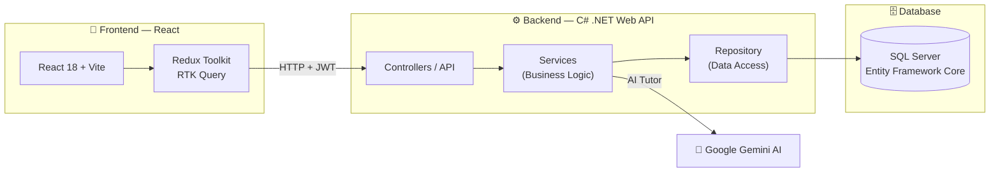
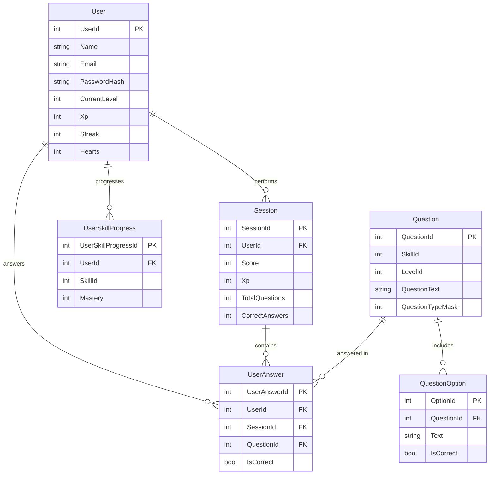

<div align="center">


# 🦉 Glottie — AI-Powered English Learning Platform

### A fun, smart, and effective way to learn English

**Full-Stack Application · React + C# .NET + SQL Server**

[](https://react.dev)
[](https://dotnet.microsoft.com)
[](https://www.microsoft.com/sql-server)
[](https://ai.google.dev)

</div>

---

## 📌 Overview

**Glottie** is a **Full-Stack** English learning application inspired by Duolingo. It combines a gamified learning experience (XP points, hearts, and streaks), an adaptive placement test, a wide variety of question types, personalized progress tracking, and an AI conversation tutor for free-form practice.

The project is split across two repositories — a **Frontend** client and a **Backend** server — and is built from three main components:

- 🎨 **Frontend** — React 18 + Vite + Redux Toolkit
- ⚙️ **Backend** — C# .NET Web API using a layered (Clean) architecture
- 🗄️ **Database** — SQL Server with Entity Framework Core (Code-First + Migrations)

---

## 🔗 Project Repositories

<div align="center">

| Component | Description | Repository |
|:---:|:---|:---:|
| ⚙️ **Backend (C# + SQL)** | API server, business logic, and database | **[github.com/tehila4510/MyProject](https://github.com/tehila4510/MyProject)** |
| 🎨 **Frontend (React)** | User interface and client application | **[github.com/tehila4510/React-Project](https://github.com/tehila4510/React-Project)** |

</div>

> 💡 The two projects work together: the React frontend sends requests to the .NET backend, which communicates with the SQL Server database and the Google Gemini AI service.

---

## 📖 Table of Contents

- [Architecture Overview](#-architecture-overview)
- [Tech Stack](#-tech-stack)
- [Features](#-features)
- [Database Design](#-database-design)
- [Backend Structure](#-backend-structure)
- [API Endpoints](#-api-endpoints)
- [The AI Tutor](#-the-ai-tutor-glottie-chat)
- [Running the Project](#-running-the-project)
- [Screens & Branding Gallery](#-screens--branding-gallery)

---

## 🏗 Architecture Overview

The diagram below shows how the three components connect:



**Typical request flow:** The user performs an action in the React app → RTK Query sends an HTTP request with a JWT token to the .NET API → the Controller passes it to a Service (business logic) → the Repository accesses the database through Entity Framework → the response travels back to the user.

---

## 🛠 Tech Stack

### 🎨 Frontend
| Technology | Role |
|---|---|
| **React 18** | UI library |
| **Vite** | Build tool and fast development server |
| **Redux Toolkit + RTK Query** | State management and API calls with caching |
| **React Router v6** | Client-side routing |
| **Material UI (MUI)** | UI component library |
| **React Toastify** | User notifications |
| **Web Speech API** | Text-to-speech for reading questions aloud |

### ⚙️ Backend
| Technology | Role |
|---|---|
| **C# / .NET Web API** | REST API server |
| **Entity Framework Core** | ORM for database access (Code-First) |
| **SQL Server** | Relational database |
| **JWT Bearer Authentication** | Secure authentication and authorization |
| **AutoMapper** | Mapping between entities and DTOs |
| **Google Gemini API** | AI engine powering the conversation tutor |
| **BackgroundService (Worker)** | Automatic reset of hearts every 24 hours |
| **Swagger / OpenAPI** | API documentation and testing |

---

## ✨ Features

### 🎓 Learning Experience
- **Placement Test** — a short test that determines the user's starting level (A1–C2).
- **Manual Level Selection** — users can choose a level, with a visual description for each one.
- **9 Skill Areas** — vocabulary, grammar, verbs, listening, reading, writing, pronunciation, phrases, and chat.
- **Versatile Question Engine** — up to 18 different question types (multiple choice, fill-in-the-blank, drag-and-drop, matching, ordering, listening, pronunciation, translation, and more), implemented using a smart **bitmask**.
- **Real-Time Feedback** — correct/incorrect responses with instant explanations.

### 🎮 Gamification
| | Feature | Description |
|:---:|---|---|
|  | **XP Points** | Earn points for every exercise and level up as you progress |
| ❤️ | **Hearts** | A limited number of mistakes per session, reset automatically every 24 hours |
|  | **Daily Streak** | Tracks consecutive days of learning |
| 🎉 | **Confetti & Celebration** | A rewarding completion animation at the end of each exercise |

### 📊 Progress Tracking
- **Progress Dashboard** — weekly XP chart, accuracy rings, and a per-skill breakdown.
- **"My Mistakes"** — a page that collects every incorrect answer alongside the correct one, so users can learn from their errors.
- **Heatmap** — a visual tracker of practice days.

### 👤 User Management
- Secure registration and login with **JWT**.
- Profile picture (avatar) upload with live preview.
- Editing of name, email, and password.
- Session persistence in `localStorage` (users stay logged in after a refresh).

---

## 🗄 Database Design

The database runs on **SQL Server** and is managed with **Entity Framework Core** using a **Code-First** approach (tables are generated from the C# classes via Migrations).



**Core tables:**
- **User** — user details, level, XP, hearts, and streak.
- **Session** — a single practice session with its score and number of correct answers.
- **Question** + **QuestionOption** — the question bank and possible answers.
- **UserAnswer** — a record of every answer a user submitted (powers the "My Mistakes" page).
- **UserSkillProgress** — the user's mastery level in each skill.

> **Levels and skills** are managed as static data in code (6 CEFR levels from A1 to C2, and 9 skills).

---

## 📂 Backend Structure

The server is built with a **layered (Clean) architecture** for clear separation of concerns:

```
MyProject/
├── MyProject/        → API layer (Controllers, Program.cs, configuration)
├── Services/         → Business logic layer (Services, AutoMapper, Workers)
├── Repository/       → Data access layer (Entities, Repositories, Interfaces)
├── DataContext/      → EF Core DbContext + all Migrations
└── Common/           → Shared code (DTOs, Enums, Exceptions, Static Data)
```

**The benefit:** each layer only depends on the layer beneath it, which keeps the code organized, testable, and easy to maintain.

---

## 🌐 API Endpoints

| Controller | Example Endpoints | Role |
|---|---|---|
| **User** | `POST /api/User/register`, `POST /api/User/login`, `POST /api/User/lose-heart` | Registration, login, user management |
| **Quiz** | `POST /api/Quiz/start-session`, `GET /api/Quiz/next-question/{id}`, `POST /api/Quiz/submit-answer` | Managing the practice flow |
| **Question** / **QuestionOption** | `GET/POST/PUT/DELETE` | Managing the question bank |
| **Session** | `GET /api/Session/my-sessions` | Session history |
| **UserAnswer** | `GET /api/UserAnswer/my-answers` | The user's answers |
| **UserSkillProgress** | `GET /api/UserSkillProgress/my-skill-progress` | Skill progress |
| **Skill** | `GET /api/Skill` | List of skills |
| **Chat** | `POST /api/Chat/ask` | Conversation with the AI tutor |

> All endpoints can be conveniently tested via **Swagger** while the server is running.

---

## 🤖 The AI Tutor (Glottie Chat)

<div align="center">

</div>

One of the project's most advanced features is a **virtual English tutor** for free-form conversation, powered by **Google Gemini**.

- The server stores the **conversation history** and sends it along with every new message as context.
- A **system instruction** guides the AI to speak in simple English, highlight and correct mistakes, and always end with a follow-up question that keeps the conversation going.
- This lets users practice English through natural conversation and receive corrections in real time.

---

## 🚀 Running the Project

### Prerequisites
- **Node.js** version 18 or higher
- **.NET SDK**
- **SQL Server** (or SQL Server Express / LocalDB)

### 1️⃣ Run the Backend

```bash
# Clone the backend repository
git clone https://github.com/tehila4510/MyProject.git
cd MyProject

# Configure the connection string and JWT key in appsettings.json
# Create the database from the migrations:
dotnet ef database update

# Run the server
dotnet run
# The API will start at https://localhost:7185
```

> ⚠️ In `appsettings.json` you must configure `ConnectionStrings:DefaultConnection` (SQL Server connection), `Jwt:Key`, and `GeminiSettings:ApiKey` (for the AI tutor).

### 2️⃣ Run the Frontend

```bash
# Clone the frontend repository
git clone https://github.com/tehila4510/React-Project.git
cd React-Project/my-react-app

# Install dependencies
npm install

# Run the app
npm run dev
# The app will open at http://localhost:5173
```

### 3️⃣ First Use
1. Open `http://localhost:5173`
2. Click **GET STARTED** and register
3. Choose a level manually **or** take the placement test
4. Start learning! 🎉

---

## 🖼 Screens & Branding Gallery

<div align="center">


</div>

### Skill Areas in the App
<div align="center">


</div>

### Main Screens
<div align="center">


</div>

---

<div align="center">

### 🦉 A Full-Stack project built with care

**React · C# .NET · SQL Server · AI**

*Keep learning, keep growing.*

</div>
