<div align="center">

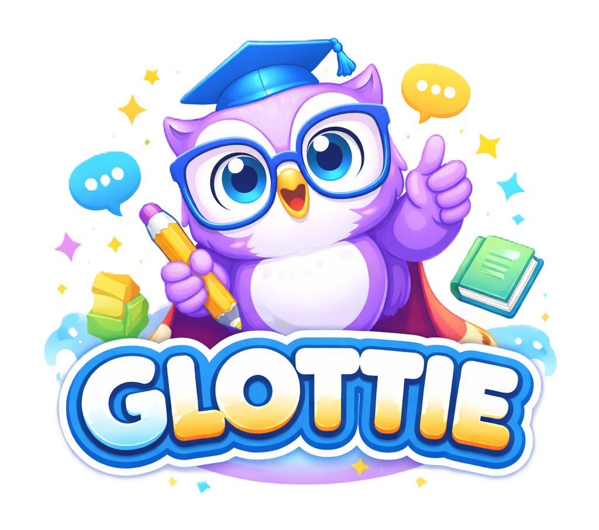

# 🦉 Glottie — AI-Powered English Learning Platform

### The fun, smart, and effective way to learn English

**Full-Stack Final Project · React + C# .NET + SQL Server**

[](https://react.dev)
[](https://dotnet.microsoft.com)
[](https://www.microsoft.com/sql-server)
[](https://ai.google.dev)

</div>

---

## 📌 About This Page

> **This is the main submission page for my final project.**
> The project is made up of two parts (repositories) — a Frontend (client side) and a Backend (server side) — and this page brings **both links** together with a full, organized explanation of everything that was built.

**Glottie** is a **Full-Stack** English learning app inspired by Duolingo: a gamification system (XP points, hearts, streaks), an adaptive placement test, many question types, personal progress tracking, and a smart AI teacher for free conversation.

The project is built from three main components:
- 🎨 **Frontend** — React 18 + Vite + Redux Toolkit
- ⚙️ **Backend** — C# .NET Web API with a layered (Clean) architecture
- 🗄️ **Database** — SQL Server with Entity Framework Core (Code-First + Migrations)

---

## 🔗 The Two Project Repositories

<div align="center">

| Part | Description | Repository Link |
|:---:|:---|:---:|
| ⚙️ **Backend (C# + SQL)** | The API server, server-side logic, and database | **[github.com/tehila4510/MyProject](https://github.com/tehila4510/MyProject)** |
| 🎨 **Frontend (React)** | The user interface and application | **[github.com/tehila4510/React-Project](https://github.com/tehila4510/React-Project)** |

</div>

> 💡 Both projects work together: the React Frontend sends requests to the .NET Backend, which talks to the database (SQL Server) and to the Google Gemini AI service.

---

## 📖 Table of Contents

- [Overall Architecture](#-overall-architecture)
- [Tech Stack](#-tech-stack)
- [Features](#-features)
- [Database Design](#-database-design)
- [Backend Code Structure](#-backend-code-structure)
- [API Endpoints](#-api-endpoints)
- [The AI Teacher](#-the-ai-teacher-glottie-chat)
- [Getting Started](#-getting-started)
- [Gallery & Branding](#-gallery--branding)

---

## 🏗 Overall Architecture

The diagram below shows how the three components connect together:

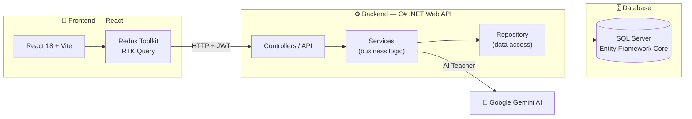

**Typical flow:** the user performs an action in the React app → RTK Query sends an HTTP request with a JWT token to the .NET API → the Controller passes it to a Service (business logic) → the Repository accesses the database via Entity Framework → the response travels all the way back to the user.

---

## 🛠 Tech Stack

### 🎨 Frontend
| Technology | Role |
|---|---|
| **React 18** | The UI library |
| **Vite** | Fast build tool and dev server |
| **Redux Toolkit + RTK Query** | State management and API calls with caching |
| **React Router v6** | Routing between screens |
| **Material UI (MUI)** | UI components |
| **React Toastify** | User notifications |
| **Web Speech API** | Reading questions aloud (Text-to-Speech) |

### ⚙️ Backend
| Technology | Role |
|---|---|
| **C# / .NET Web API** | The REST API server |
| **Entity Framework Core** | ORM for database access (Code-First) |
| **SQL Server** | The database |
| **JWT Bearer Authentication** | Secure authentication and authorization |
| **AutoMapper** | Mapping between Entities and DTOs |
| **Google Gemini API** | The AI engine behind the conversation teacher |
| **BackgroundService (Worker)** | Automatic reset of hearts every 24 hours |
| **Swagger / OpenAPI** | API documentation and testing |

---

## ✨ Features

### 🎓 Learning Experience
- **Placement Test** — a short test that determines the user's starting level (A1–C2).
- **Manual Level Selection** — the option to pick a level with a visual description for each one.
- **9 Skill Areas** — Vocabulary, Grammar, Verbs, Listening, Reading, Writing, Pronunciation, Phrases, and Chat.
- **Diverse Question Engine** — up to 18 different question types (multiple choice, fill in the blank, drag and drop, matching, ordering, listening, pronunciation, translation, and more) implemented using a smart **Bitmask**.
- **Real-Time Feedback** — correct/incorrect answers with an instant explanation.

### 🎮 Gamification
| | Feature | Description |
|:---:|---|---|
|  | **XP Points** | Earn points for every practice session and progress between levels |
| ❤️ | **Hearts** | A limited number of mistakes per session, reset automatically every 24 hours |
|  | **Streaks** | Tracking your streak of learning days |
| 🎉 | **Confetti & Celebration** | A rewarding completion animation at the end of every practice |

### 📊 Progress Tracking
- **Progress Dashboard** — weekly XP chart, accuracy rings, and a per-skill breakdown.
- **"My Mistakes"** — a page that collects every incorrect answer alongside the correct one, to learn from your mistakes.
- **Heatmap** — a visual tracking of your practice days.

### 👤 User Management
- Secure registration and login with **JWT**.
- Profile picture (avatar) upload with a live preview.
- Editing name, email, and password.
- Session persistence in `localStorage` (the user stays logged in even after refreshing).

---

## 🗄 Database Design

The database is managed in **SQL Server** using **Entity Framework Core** with a **Code-First** approach (the tables are created from the C# classes through Migrations).

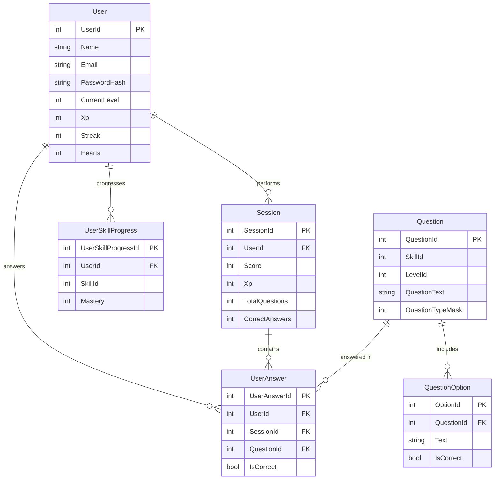

**The main tables:**
- **User** — user details, level, XP, hearts, and streak.
- **Session** — a single practice session with a score and number of correct answers.
- **Question** + **QuestionOption** — the pool of questions and their possible answers.
- **UserAnswer** — a record of every answer the user gave (used for "My Mistakes").
- **UserSkillProgress** — the user's mastery level in each skill.

> **Levels and skills** are managed as Static Data in the code (6 CEFR levels from A1 to C2, and 9 skills).

---

## 📂 Backend Code Structure

The server is built with a **layered (Clean) architecture** for a clear separation of concerns:

```
MyProject/
├── MyProject/        → The API layer (Controllers, Program.cs, configuration)
├── Services/         → The business logic layer (Services, AutoMapper, Workers)
├── Repository/       → The data access layer (Entities, Repositories, Interfaces)
├── DataContext/      → The EF Core DbContext + all the Migrations
└── Common/           → Shared code (DTOs, Enums, Exceptions, Static Data)
```

**The benefit:** each layer only knows about the layer below it, which makes the code organized, testable, and easy to maintain.

---

## 🌐 API Endpoints

| Controller | Example Endpoints | Role |
|---|---|---|
| **User** | `POST /api/User/register`, `POST /api/User/login`, `POST /api/User/lose-heart` | Registration, login, user management |
| **Quiz** | `POST /api/Quiz/start-session`, `GET /api/Quiz/next-question/{id}`, `POST /api/Quiz/submit-answer` | Managing the practice flow |
| **Question** / **QuestionOption** | `GET/POST/PUT/DELETE` | Managing the question pool |
| **Session** | `GET /api/Session/my-sessions` | Session history |
| **UserAnswer** | `GET /api/UserAnswer/my-answers` | The user's answers |
| **UserSkillProgress** | `GET /api/UserSkillProgress/my-skill-progress` | Progress across skills |
| **Skill** | `GET /api/Skill` | The list of skills |
| **Chat** | `POST /api/Chat/ask` | Conversation with the AI teacher |

> All the endpoints can be tested conveniently through **Swagger** while the server is running.

---

## 🤖 The AI Teacher (Glottie Chat)

<div align="center">
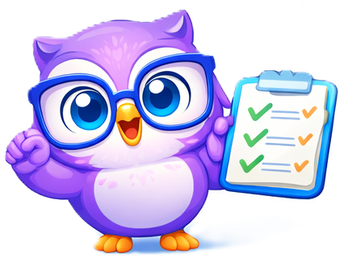
</div>

One of the more advanced features in the project is a **virtual English teacher** for free conversation, powered by the **Google Gemini** model.

- The server keeps the **conversation history** and sends it along with every new message (context).
- A **System Instruction** was defined to guide the AI to speak in simple English, highlight corrections to mistakes, and always end with a follow-up question that encourages continuing the conversation.
- This way the user practices English in a natural conversation and gets corrections in real time.

---

## 🚀 Getting Started

### Prerequisites
- **Node.js** version 18 or higher
- **.NET SDK**
- **SQL Server** (or SQL Server Express / LocalDB)

### 1️⃣ Run the Backend

```bash
# Clone the server repository
git clone https://github.com/tehila4510/MyProject.git
cd MyProject

# Set the Connection String and JWT key in appsettings.json
# Create the database from the Migrations:
dotnet ef database update

# Run the server
dotnet run
# The API will be available at https://localhost:7185
```

> ⚠️ You need to set `ConnectionStrings:DefaultConnection` (the SQL Server connection), `Jwt:Key`, and `GeminiSettings:ApiKey` (for the AI teacher) in `appsettings.json`.

### 2️⃣ Run the Frontend

```bash
# Clone the React repository
git clone https://github.com/tehila4510/React-Project.git
cd React-Project/my-react-app

# Install the packages
npm install

# Run the app
npm run dev
# The app will open at http://localhost:5173
```

### 3️⃣ First Run
1. Go to `http://localhost:5173`
2. Click **GET STARTED** and register
3. Choose a level manually **or** take the placement test
4. Start learning! 🎉

---

## 🖼 Gallery & Branding

<div align="center">

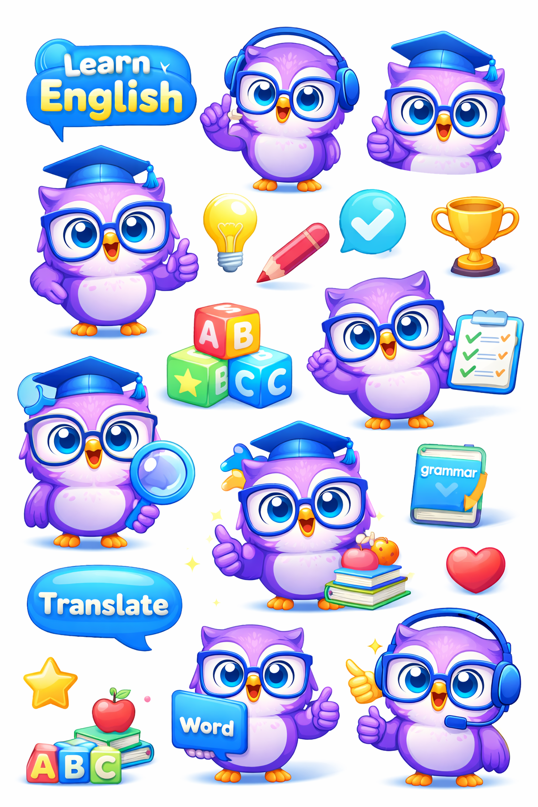

</div>

### The Skill Areas in the App
<div align="center">

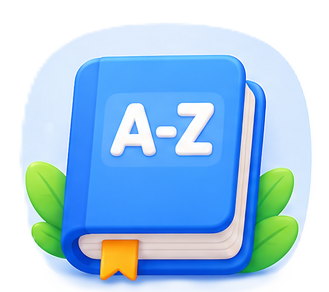
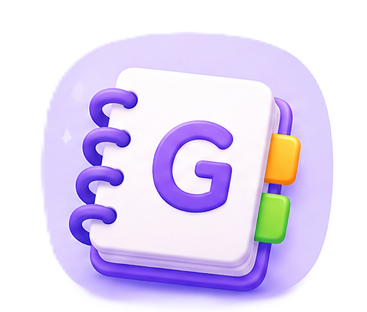

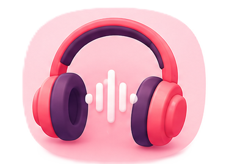
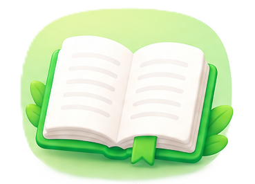

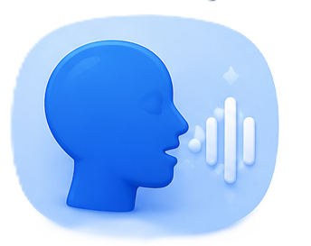
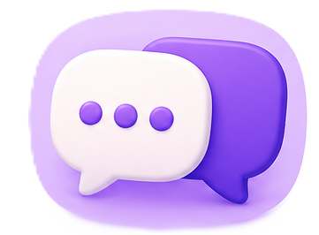
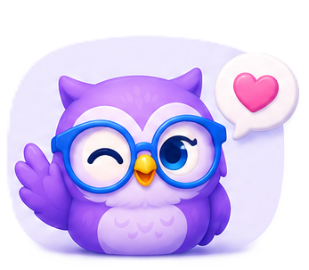

</div>

### Main Screens
<div align="center">

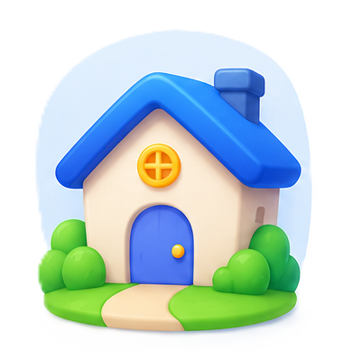
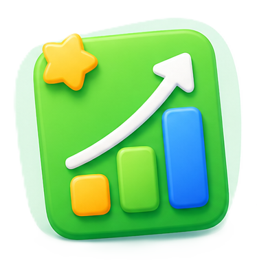

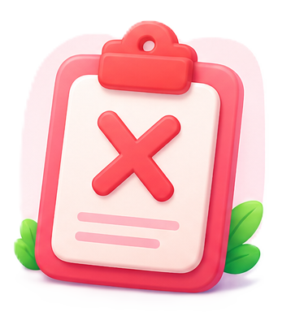
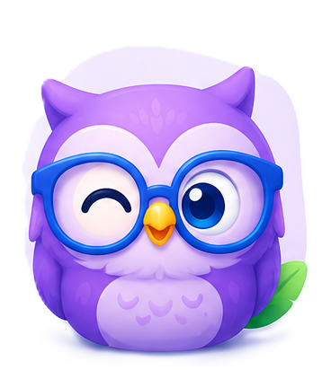

</div>

---

<div align="center">

### 🦉 Built with love as a Full-Stack final project

**React · C# .NET · SQL Server · AI**

*Keep learning, keep growing.*

</div>
